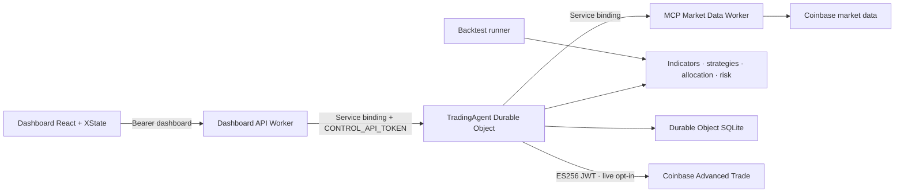

# DoDash

Bot de trading stateful pour Cloudflare Agents, construit comme un monorepo
pnpm/Turborepo. Le cœur fonctionnel est pur et déterministe ; les Workers
Cloudflare portent les effets réseau, la planification, les secrets et la
persistance.

> Le mode `paper` est la valeur par défaut. Le mode `live` peut placer de vrais
> ordres Coinbase et reste fermé tant qu'il n'est pas explicitement activé et
> correctement configuré.

## Architecture



| Zone | Rôle |
| --- | --- |
| `models/` | Machines XState, événements, transitions, invariants et revues |
| `packages/domain` | Primitives validées et résultats typés |
| `packages/indicators-prolog` | Indicateurs purs exécutés via Tau-Prolog |
| `packages/strategies` | Registre multi-stratégie et signaux normalisés |
| `packages/allocator`, `packages/risk` | Décision déterministe et garde-fous |
| `packages/backtest` | Rejeu du même cœur métier sans I/O |
| `apps/mcp-market-data` | MCP et frontière Coinbase read-only, cache KV |
| `apps/agent` | Durable Object, Alarm API, SQLite et exécution Coinbase |
| `apps/dashboard-api` | Proxy de contrôle same-origin, authentifié et borné |
| `apps/dashboard` | Surface React et Worker public d'assets pilotés par le modèle de session |

Le LLM ne décide d'aucune transition. Les signaux entrent dans les modèles ;
seules les machines et règles déterministes choisissent les états suivants.

## Prérequis et vérification

- Node.js 22
- pnpm 11.21 via Corepack
- un compte Cloudflare uniquement pour le provisioning ou le déploiement

```sh
corepack enable pnpm
pnpm install --frozen-lockfile
pnpm check
pnpm test
pnpm build
pnpm --filter @dodash/dashboard test:sites
```

Le dashboard peut être inspecté sans secret avec **Voir la démo** :

```sh
pnpm --filter @dodash/dashboard dev
```

## Configuration des Workers

Copier les exemples `.dev.vars.example` en `.dev.vars` dans :

- `apps/mcp-market-data` pour `INTERNAL_SERVICE_TOKEN` ;
- `apps/agent` pour les tokens internes et, facultativement, Coinbase live ;
- `apps/dashboard-api` pour le token opérateur et le token de contrôle Agent.

Les tokens doivent contenir au moins 32 caractères. En production, les placer
avec `wrangler secret put` et ne jamais les écrire dans `wrangler.jsonc`.
Le namespace KV `dodash-market-cache` est provisionné séparément et son
identifiant est versionné dans `apps/mcp-market-data/wrangler.jsonc`.

Ordre de déploiement : market data, Agent, dashboard API, puis dashboard. Seul
`dodash-dashboard` est public ; il transmet `/api/*` au proxy privé par service
binding et sert le reste depuis le binding d'assets statiques. Le paquet Sites
reste généré et testé comme option de publication alternative. Le déploiement
peut être déclenché manuellement par `.github/workflows/ci.yml` après avoir
configuré l'environnement GitHub `production` et les secrets Cloudflare.

## Découpage des changements

Tout changement métier suit `Model → Review → Implement → Verify`. Les commits
utilisent Conventional Commits ; l'historique du dépôt conserve chaque jalon
exécutable.
