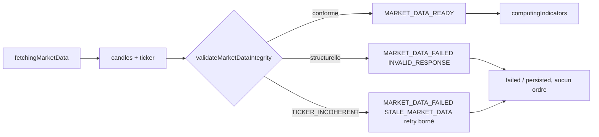

# Intégrité des données de marché — continuité, monotonie, cohérence ticker

Statut : MODÉLISÉ (dao #25 — résultats de vérification en §8)

## 1. Contexte et décision

Le garde-fou d'âge existe déjà : `models/trading-cycle.machine.ts`
(`isFreshMarketData`) rejette toute bougie dont
`triggeredAt − candleClosedAt > maxMarketStalenessMs` avec le code fermé
`STALE_MARKET_DATA`. Ce garde n'est **pas** dupliqué ici.

Trois angles morts subsistent en amont, sur la série elle-même :

1. **Continuité** — un intervalle manquant dans la série de bougies fausse
   silencieusement EMA/RSI/ATR (calculés sur série discontinue) ;
2. **Monotonie** — timestamps non strictement croissants ou dupliqués
   (aujourd'hui : doublon et désordre déjà rejetés par
   `validateCandleSeries`, mais sans continuité ni ticker) ;
3. **Cohérence ticker** — divergence entre le ticker courant et la
   dernière bougie fermée, non détectée (l'agent ne consomme pas
   `/internal/ticker` à ce jour).

Décision : trois contrôles **purs et fermés** dans `@dodash/domain`,
branchés sur le chemin des données de marché **avant** l'événement
`MARKET_DATA_READY`, donc strictement avant `computingIndicators`.
Chaque violation emprunte un chemin fail-closed **existant** de la
machine (`MARKET_DATA_FAILED` / `STALE_MARKET_DATA`) — **aucun nouvel
état d'arrêt, aucune retouche de la machine**.

## 2. Mécanique relevée (inchangée)

- **Live** : `apps/agent/src/market-service.ts → fetchMarketSnapshot` —
  `POST /internal/candles` (worker `apps/mcp-market-data`, cache KV) →
  `createCandle` par élément → `validateCandleSeries` → snapshot →
  `interpreter.ts` envoie `MARKET_DATA_READY` → machine :
  `isDuplicateDecisionCandle` / `isFreshMarketData` (âge) / retry borné /
  `NO_ACTION`.
- **Rejeu** : `packages/backtest/src/replay.ts → replayBacktest` —
  `validateCandleSeries` (décision et exécution) puis
  `createExecutionSchedule` (uniformité decision↔exécution uniquement
  quand des bougies d'exécution sont fournies).
- **Codes fermés disponibles** : `WorkflowErrorCode`
  (`INVALID_RESPONSE`, `STALE_MARKET_DATA`, `NETWORK_UNAVAILABLE`,
  `RATE_LIMITED`) et `MarketValidationError` (`EMPTY_CANDLE_SERIES`,
  `UNSORTED_CANDLE_SERIES`, `DUPLICATE_CANDLE`, `index`).

## 3. Modèle — `validateMarketDataIntegrity`

Fonction **pure** dans `packages/domain/src/market.ts` :

```ts
// Tolérance figée par le présent modèle (§3, contrôle 3). Aucune autre
// constante de divergence n'est licite ailleurs dans le code.
export const MAX_TICKER_DIVERGENCE_BPS = 100;

// Table canonique des durées (source unique — le modèle fige ces valeurs).
export const TIMEFRAME_MILLISECONDS: Readonly<Record<Timeframe, number>>;

export type MarketDataIntegrityError =
  | { readonly code: "INVALID_INTERVAL" }
  | { readonly code: "INVALID_SERIES"; readonly cause: MarketValidationError }
  | { readonly code: "CANDLE_GAP"; readonly index: number;
      readonly expectedIntervalMs: number }
  | { readonly code: "TICKER_INVALID_PRICE" }
  | { readonly code: "TICKER_INCOHERENT"; readonly divergenceBps: number;
      readonly maxDivergenceBps: number };

validateMarketDataIntegrity(
  candles: readonly Candle[],
  intervalMs: number,                     // cadence déclarée, entier sûr > 0
  ticker: { readonly price: number } | null, // null licite uniquement au rejeu
): Result<readonly Candle[], MarketDataIntegrityError>
```

Ordre de vérification **figé** (premier échec gagnant) :

1. `intervalMs` non entier sûr ou ≤ 0 → `INVALID_INTERVAL` ;
2. structure de la série déléguée à `validateCandleSeries` (codes
   existants `EMPTY_CANDLE_SERIES`, `INVALID_*`, `UNSORTED_CANDLE_SERIES`,
   `DUPLICATE_CANDLE` — **aucun nouveau code**, index conservé) →
   `INVALID_SERIES` ;
3. **continuité** : pour tout `i ≥ 1`,
   `candles[i].start − candles[i−1].start === intervalMs` (égalité
   stricte, aucune tolérance) ; première violation → `CANDLE_GAP`
   `{ index: i, expectedIntervalMs }` ;
4. **cohérence ticker** (si `ticker !== null`, série non vide) :
   - `price` non fini ou ≤ 0 → `TICKER_INVALID_PRICE` ;
   - `divergenceBps = |price − dernièreBougie.close| / dernièreBougie.close
     × 10 000` ; `divergenceBps > 100` → `TICKER_INCOHERENT`
     `{ divergenceBps, maxDivergenceBps: 100 }` ;
   - `divergenceBps ≤ 100` (borne incluse) → conforme.

Mapping des causes vers les codes fermés **existants** de la machine
(côté adapter, uniquement) :

| Cause d'intégrité | Classe | WorkflowError émis | Chemin machine |
| --- | --- | --- | --- |
| `INVALID_INTERVAL`, `INVALID_SERIES`, `CANDLE_GAP`, `TICKER_INVALID_PRICE` | structurelle | `INVALID_RESPONSE` non retryable | `MARKET_DATA_FAILED` → échec après enregistrement |
| `TICKER_INCOHERENT` | divergence (classe péremption) | `STALE_MARKET_DATA` retryable | `MARKET_DATA_FAILED` → retry borné `marketData` puis `failed` |
| échec transport ticker | réseau | `NETWORK_UNAVAILABLE` / `RATE_LIMITED` retryable, `INVALID_RESPONSE` non retryable (4xx) | identique au chemin candles existant |

## 4. Points de branchement (précis)

### 4.1 Live — `apps/agent/src/market-service.ts`

Dans `fetchMarketSnapshot`, après réception et construction des bougies,
**avant** la construction du snapshot (donc avant `MARKET_DATA_READY` et
avant `computingIndicators`) :

1. `POST /internal/ticker` sur le même service binding, même
   authentification, même borne de taille de réponse ; schéma fermé
   `{ productId, price, observedAt, source: "coinbase", cached }` ;
   `productId` doit égalé la configuration ;
2. `validateMarketDataIntegrity(candles, TIMEFRAME_MILLISECONDS[timeframe],
   { price })` ;
3. rejet → `Result.err(WorkflowError)` selon la table §3 + télémétrie
   `console.warn` portant la cause fermée détaillée ; l'interpréteur
   envoie alors `MARKET_DATA_FAILED` (chemin existant, inchangé).

Aucune modification de `trading-cycle.machine.ts`, de
`trading-cycle.types.ts` (aucun nouveau code), ni de l'interpréteur.

### 4.2 Rejeu — `packages/backtest/src/replay.ts`

`replayBacktest` valide séries de décision **et** d'exécution via le
**même cœur** (`ticker: null` — aucun ticker n'existe au rejeu) :

- `BacktestConfig` gagne `intervalMs: number` (cadence déclarée) ;
- `BacktestReplayOptions` gagne `executionIntervalMs: number`,
  requis dès que `executionCandles` est fourni (rejet fermé
  `INVALID_EXECUTION_CANDLES` sinon — fail-closed à l'exécution) ;
- la couche modélisée (`suite.ts`) dérive les intervalles de
  `dataset.timeframe` via `TIMEFRAME_MILLISECONDS` — aucune constante
  locale divergente ;
- causes rejetées dans les erreurs existantes `INVALID_CANDLES` /
  `INVALID_EXECUTION_CANDLES` (champ `cause` élargi).



## 5. Invariants

- **INV-I1 (fail-closed)** — toute série douteuse est rejetée. Aucune
  bougie synthétique, aucune interpolation, aucun zéro de substitution,
  nulle part, en aucun cas.
- **INV-I2 (source unique des seuils)** — la tolérance ticker (100 bps)
  et la table des durées sont figées par le présent modèle ; le code les
  porte comme constantes uniques de `@dodash/domain`
  (`MAX_TICKER_DIVERGENCE_BPS`, `TIMEFRAME_MILLISECONDS`) ; aucune
  constante divergente n'est licite ailleurs.
- **INV-I3 (pureté)** — la validation est déterministe, sans horloge,
  sans I/O, sans LLM : même entrée ⇒ même sortie. Le LLM ne produit
  aucun signal sur ce chemin ; la décision de rejet reste portée par la
  machine via des événements typés existants.
- **INV-I4 (non-duplication de l'âge)** — les contrôles ne consultent
  jamais `triggeredAt` ni `maxMarketStalenessMs` ; la fraîcheur d'âge
  reste exclusivement jugée par `isFreshMarketData`.
- **INV-I5 (ordre figé)** — intervalle → structure → continuité →
  ticker ; premier échec gagnant ; toute violation de série porte
  l'index de la bougie fautive.
- **INV-I6 (non-régression)** — une série conforme (continue, croissante,
  sans doublon, ticker dans la tolérance) produit exactement le même
  résultat qu'avant ; aucune erreur nouvelle n'est possible sur données
  conformes.
- **INV-I7 (même cœur)** — live et rejeu passent par la même fonction
  pure. `ticker: null` n'est licite qu'au rejeu ; le chemin live fournit
  toujours un ticker (échec d'obtention ⇒ rejet fail-closed, jamais de
  contrôle silencieusement ignoré).

## 6. Protocole de vérification

1. **Domaine** (purs) : série trouée au milieu (index explicite),
   désordonnée, dupliquée, vide, intervalle invalide ; ticker hors
   tolérance (borne 100 bps exacte conforme, au-delà rejetée), prix
   ticker invalide ; `ticker: null` ; série conforme acceptée.
2. **Live** (`market-service`) : trouée → `INVALID_RESPONSE` non
   retryable ; ticker divergent → `STALE_MARKET_DATA` retryable ; échec
   réseau ticker → `NETWORK_UNAVAILABLE` retryable ; série conforme →
   snapshot identique à l'existant.
3. **Rejeu** : série de décision trouée → `INVALID_CANDLES` (cause
   `CANDLE_GAP`, aucun trade) ; exécution trouée →
   `INVALID_EXECUTION_CANDLES` ; `executionCandles` sans
   `executionIntervalMs` → rejet fermé.
4. **Non-régression (C3)** : suites `pnpm check`, `pnpm test`, `pnpm
   build`, `pnpm lint` vertes sans nouveau warning.

## 7. Hors périmètre

- Fraîcheur du ticker (`observedAt`) : une staleness ticker dédiée
  exigerait un nouveau chemin d'état — exclu ; la divergence de prix
  couvre le défaut principal.
- Nouveaux états machine, nouveaux `WorkflowErrorCode`, nouveau code
  `MarketValidationError`.
- Redondance multi-source du ticker, calibration adaptative de la
  tolérance (la tolérance est figée, jamais apprise).

## 8. Résultats de vérification

Commandes : `pnpm check`, `pnpm test` (turbo, force), `pnpm build`,
`pnpm lint` — toutes vertes, **aucun nouveau warning** (baseline lint
inchangée : 9 warnings préexistants, hors fichiers touchés).

| Suite | Résultat |
| --- | --- |
| `@dodash/domain` | 14/14 (8 nouveaux : trouée index, désordonnée, dupliquée, vide, intervalle, borne 100 bps incluse, prix ticker invalide, ticker null) |
| `apps/agent` (market-service) | 174/174 (3 nouveaux : trouée → `INVALID_RESPONSE`, ticker 200 bps → `STALE_MARKET_DATA`, ticker injoignable → `NETWORK_UNAVAILABLE` ; mocks routés candles/ticker) |
| `@dodash/backtest` | 103/103 (3 nouveaux : décision trouée → `INVALID_CANDLES`/`CANDLE_GAP` index 3 + jumeau conforme OK ; exécution trouée → `INVALID_EXECUTION_CANDLES` ; `executionCandles` sans cadence → rejet fermé) |
| Total (19 tâches turbo) | 784 tests, 0 échec |

Non-régression (INV-I6/C3) : suites préexistantes intégralement vertes
sans modification de comportement sur séries conformes ; seuls les
doubles de `fetch` du test market-service et les fixtures `BacktestConfig`
(`intervalMs` déclaré, mechanical) ont été adaptés au nouveau contrat.
Aucune bougie synthétique ni interpolation introduite (INV-I1).
