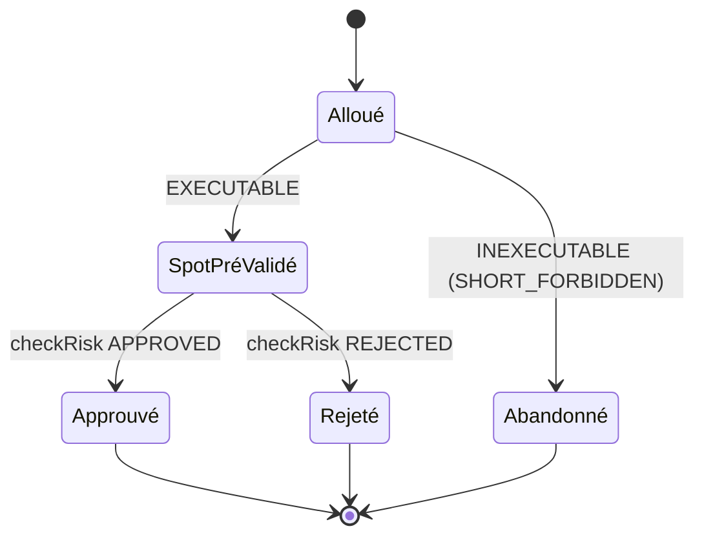

# Pré-validation spot amont — ordres SELL non exécutables (`SPOT_SHORT_FORBIDDEN`)

Statut : VÉRIFIÉ (D3' PASS — 2026-02-27)

## 1. Contexte et décision

Le diagnostic `risk-rejection-diagnosis.md` §7 a mesuré : 92,1 % des
ordres droppés par le risk engine sont des `SPOT_SHORT_FORBIDDEN` —
des SELL dont la quantité excède la position détenue (position nulle
dans 100 % des cas IDENTITY). Ces ordres ne sont **pas exécutables**
en spot : le broker live les refuserait identiquement. Les compter
comme des rejets de risk rend le gate sélecteur
`riskRejectionRate = 0` structurellement insatisfaisable (Q3).

Décision : déplacer ce filtrage **en amont** de `checkRisk`, dans le
pipeline, via une permission explicite modélisée — exactement comme
`resolveRegimePermission` le fait pour le régime. Le risk engine ne
voit plus que des ordres exécutables ; sa métrique ne mesure plus
que des rejets *significatifs* (plafonds, limites).

## 2. Mécanique relevée (inchangée)

- `checkRisk` (risk.ts L100-105) rejette `SPOT_SHORT_FORBIDDEN` ssi
  `currentPositionQuantity + signedQuantity < -1e-12` — rejet
  **binaire**, sans clamp partiel.
- Replay (replay.ts) : boucle d'ordres → checkRisk → drop silencieux
  des rejetés. Une décision → au plus un ordre netted par produit
  (allocator.ts L74-125, single product ici).
- Live (interpreter.ts L338-350) : même `checkRisk`, drop via
  `RISK_REJECTED` — sémantique économique identique au replay.

## 3. Modèle — `resolveSpotPermission`

Nouvelle fonction pure dans `models/spot-permission.ts` :

```ts
type SpotPermission =
  | { readonly status: "EXECUTABLE" }
  | { readonly status: "INEXECUTABLE"; readonly reason: "SHORT_FORBIDDEN" };

resolveSpotPermission(
  side: "BUY" | "SELL",
  quantity: number,          // > 0, fini
  positionQuantity: number,  // fini (≥ 0 en spot)
): Result<SpotPermission, { code: "INVALID_SPOT_PERMISSION_INPUT" }>
```

- Prédicat (miroir exact de risk.ts, tolérance `1e-12` partagée par
  constante documentée — `models/` ne dépend pas de `@dodash/risk`) :
  `INEXECUTABLE` ssi `positionQuantity + (side === "BUY" ? quantity : -quantity) < -1e-12`.
- Sémantique **DROP, jamais CLAMP** : un ordre partiellement
  couvert (SELL 0,5 pour position 0,3) est intégralement abandonné,
  comme le fait `checkRisk` aujourd'hui. Le clamp est une évolution
  comportementale hors périmètre (§8).
- Position dans le pipeline : **après allocation, avant checkRisk**.
  Un ordre INEXECUTABLE n'est jamais soumis au risk engine.

### États et transitions (par ordre)



### Invariants

- **INV-S1 (équivalence économique)** — Pour tout ordre, `checkRisk`
  renvoie `SPOT_SHORT_FORBIDDEN` ssi `resolveSpotPermission` renvoie
  `INEXECUTABLE` (même prédicat, mêmes entrées). Corollaire : l'ensemble
  des ordres exécutés est **bit-identique** avant/après ; toutes les
  métriques économiques (returns, dd, trades, equity) sont inchangées.
- **INV-S2 (précédence)** — Un ordre INEXECUTABLE est droppé **avant**
  toute évaluation risk : il ne produit jamais de `reasonCode`. Si un
  état risk global (kill switch, daily loss) coexiste avec une
  inexécutabilité spot, l'ordre est compté spot-abandonné, pas
  risk-rejeté (les deux issues sont économiquement équivalentes :
  drop). Sous config V1, aucune branche amont de checkRisk ne tire
  (kill=false, daily=0 mesuré, cooldown=0, orderNotional jamais).
- **INV-S3 (exhaustivité diagnostic)** — Toute observation avec
  `spotInexecutableNotional > 0` correspond à ≥ 1 ordre abandonné ;
  la somme des notionnels abandonnés ≤ `allocatedNotional`.

## 4. Instrumentation diagnostic (D1')

- `AllocationDiagnosticObservation` gagne
  `spotInexecutableNotional: number` (somme des notionnels des ordres
  abandonnés par pré-validation ; 0 sinon). Validation : fini, ≥ 0,
  ≤ `allocatedNotional` + tolérance.
- `AllocationDiagnostics` gagne `spotInexecutableCount` (décisions
  avec ≥ 1 abandon spot).
- **Redéfinition de la mesure risk** :
  - `spotExecutableNotional = allocatedNotional − spotInexecutableNotional` ;
  - population `riskEvaluated` : `spotExecutableNotional > 0` (était
    `allocatedNotional > 0`) ;
  - rejet : `riskApprovedNotional < spotExecutableNotional − tolérance`
    (était comparé à `allocatedNotional`).
  - Conséquence : une décision entièrement inexécutable sort du
    dénominateur de `riskRejectionRate` — c'est la re-attribution
    visée. `capRate` reste calculé sur `allocatedNotional` (étage
    allocation, inchangé).
- `rejectedReasonCodes` ne contient plus jamais `SPOT_SHORT_FORBIDDEN`
  en provenance du replay (le code reste valide dans l'union —
  consommable par d'autres sources).

## 5. Implémentation (consumers)

- `packages/backtest/src/replay.ts` : boucle d'ordres — appel
  `resolveSpotPermission` avant `checkRisk`, drop + accumulation
  `spotInexecutableNotional`, nouvelle erreur
  `SPOT_PERMISSION_FAILURE` (cause `SpotPermissionError`) pour les
  entrées invalides, champ `spotInexecutableNotional` dans
  l'observation.
- `models/backtest-diagnostics.{types,ts}.ts` : champs + validation +
  re-définition de la mesure (§4).
- Export `models/index.ts`.

## 6. Protocole de vérification (D2')

1. Tests unitaires : prédicat miroir (BUY jamais inexecutable,
   SELL à plat oui, SELL partiel oui, tolérance 1e-12),
   validation entrées, INV-S3 (rejet observation
   `spotInexecutableNotional > allocatedNotional`).
2. Baselines économiques : 2023/2025 IDENTITY (ret/dd bit-identiques
   au walk-forward) + 2022 IDENTITY (riskRej 23,08 % → attendu 0 %,
   SPOT seul) + 2016 QUARTER (13 SPOT + 3 POSITION → attendu 3
   POSITION seulement, ret/dd inchangés).
3. Suite complète existante (aucune métrique ne bouge).

## 7. Critères de verdict (D3')

- Équivalence économique : baselines bit-identiques → sinon INVALIDE.
- Re-attribution : plus aucun `SPOT_SHORT_FORBIDDEN` dans les
  rejets replay ; `riskRejectionRate` IDENTITY = 0 sur toutes les
  fenêtres testées ; rejets restants = plafonds nominaux
  (`POSITION_NOTIONAL_LIMIT`) uniquement.

## 8. Résultats de vérification (D2'/D3')

Harnais : `packages/backtest/scripts/spot-prevalidation-verification.ts`
(4 runs config V1, pré-changement via stash vs post-changement,
métriques économiques comparées bit-à-bit).

| Fenêtre | ret pré → post | dd pré → post | trades | SPOT pré → post | riskRej pré → post |
|---|---|---|---|---|---|
| 2023 IDENTITY | 0,2702 % = | 2,926 % = | 50 | 10 → 0 | 19,61 % → 0 % |
| 2025 IDENTITY | 3,6261 % = | 3,3729 % = | 89 | 11 → 0 | 15,94 % → 0 % |
| 2022 IDENTITY | −1,0325 % = | 1,7392 % = | 56 | 12 → 0 | 23,08 % → 0 % |
| 2016 QUARTER | 45,373 % = | 20,049 % = | 68 | 13 → 0 | 20,78 % → 4,69 % (3 POSITION) |

- `totalReturn`/`maxDrawdown`/`winRate`/`profitFactor`/`trades`
  **bit-identiques** sur les 4 fenêtres (INV-S1 prouvé).
- `SPOT_SHORT_FORBIDDEN` = 0 partout post-changement.
- `spotInexecutableCount` post = SPOT pré exactement (10/11/12/13) —
  re-attribution exacte, aucune perte ni double comptage.
- 2016 QUARTER : dénominateur 77 → 64 (13 inexécutables sortis),
  rejets 16 → 3 POSITION restants (mesure redéfinie §4).
- Logs bruts : `/tmp/spot-verification-{pre,post}.log`.

## 9. Hors périmètre (décisions sortantes)

- **Clamp partiel** des SELL couverts par la position (exécution
  partielle) — changement comportemental, cycle dédié.
- **Câblage live** (`interpreter.ts`) : le live droppe déjà ces
  ordres via `RISK_REJECTED` (économie identique) ; insérer l'étape
  de pré-validation dans la machine live = modification
  d'orchestration, cycle dédié.
- Redéfinition du gate sélecteur (après mesure de l'impact).
- Sizing conditionné par régime (cycle 3 planifié).
